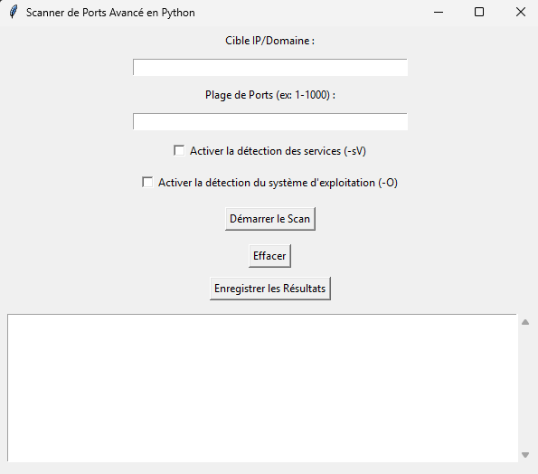

# Scanner de Ports Avancé en Python

Ce projet est un scanner de ports utilisant Nmap, avec une interface graphique simple basée sur Tkinter. 

## Fonctionnalités

- Scanne les ports d'une cible spécifiée.
- Détection des services (-sV).
- Détection du système d'exploitation (-O).
- Interface graphique avec Tkinter.
- Sauvegarde des résultats dans un fichier CSV.

## Prérequis

Avant de lancer l'application, assurez-vous d'avoir les éléments suivants installés :

- Python 3.x
- Nmap
- Tkinter 

## GUI

